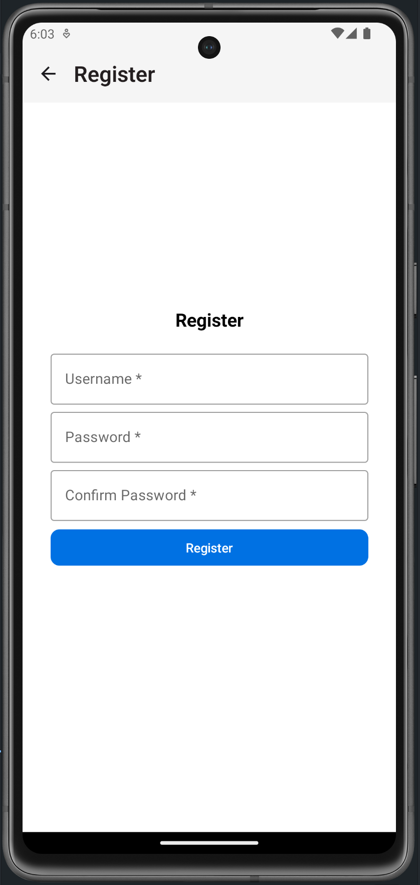
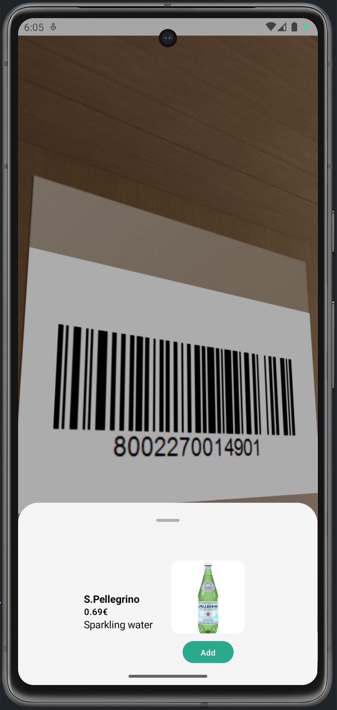
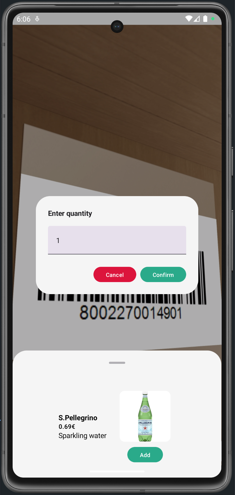
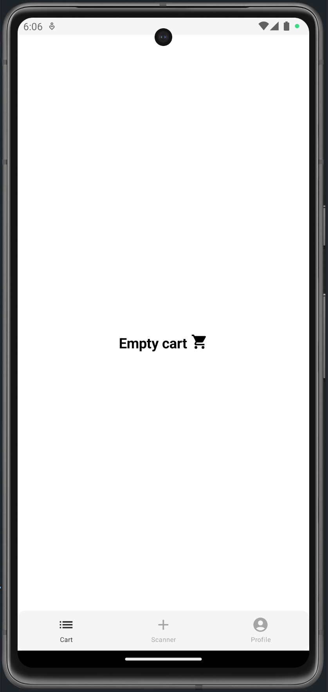
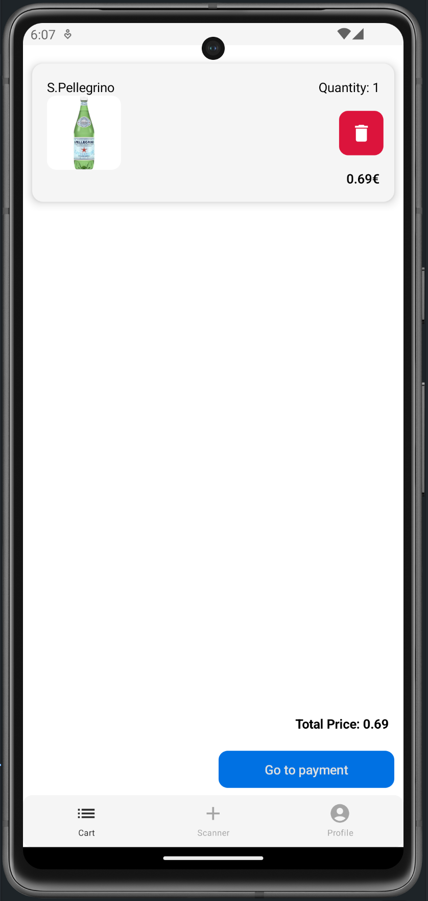
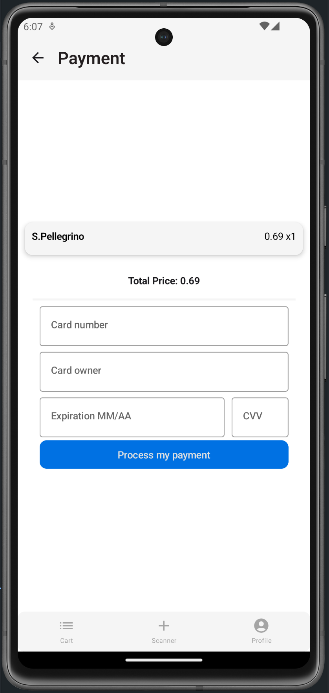

# Cash manager interface

6 screens:
- Login
- Register
- Scanner
- Cart
- Profile
- Payment

This is where user can interact with products that are available on the server.

User can create an account with unique username and password

They can also scan a product, choose quantity, add to cart and purchase.

[//]: # (![img.png]&#40;documentation/assets/loginScreen.png&#41;)

[//]: # (![img.png]&#40;documentation/assets/registerScreen.png&#41;)

[//]: # (![img.png]&#40;documentation/assets/scannerScreen.png&#41;)

[//]: # (![img.png]&#40;documentation/assets/scannerScreen2.png&#41;)

[//]: # (![img.png]&#40;documentation/assets/cartScreen1.png&#41;)

[//]: # (![img.png]&#40;documentation/assets/cartScreen2.png&#41;)

[//]: # (![img.png]&#40;documentation/assets/paymentScreen.png&#41;)

</img> </img> </img> </img> </img> </img> </img>