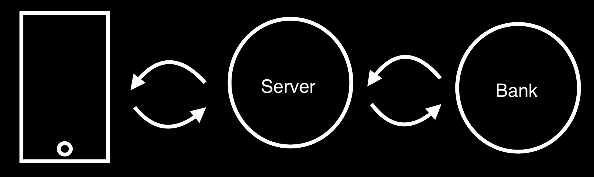

# T-DEV-700

The project is divided into 3 parts: 
- Bankserver
- Server
- Interface
 
#### The purpose of this project is to create an environment that simulates going shopping and using an application to buy & pay for items.

To do this, we first need to create a bank server where we can simulate transactions as well as creation of bank accounts, credit card.
Next, we also need a server where we can host product's information, user's cart and even user's account. This simulates the server, database of a shop or supermarket.
Finally, we need an interface where users can interact with it.

#### Technologies:
- Bankserver: Java Spring Boot
- Server: Java Spring Boot
- Interface: Kotlin Jetpack Compose

Credits: 
- Vu Minh Duc BUI
- Charles LAMARQUE
- Chun LAM
- Florian AUTOUR
- Alexandre ANDRIEUX

This is an Epitech's project.

**@2024**

